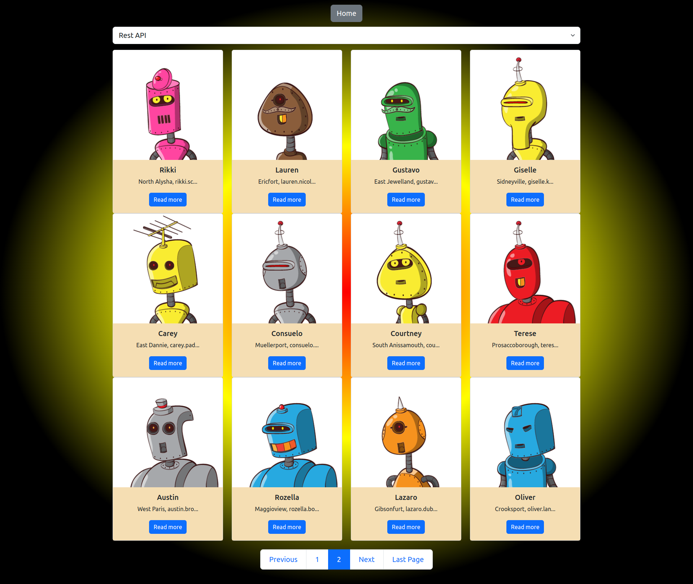
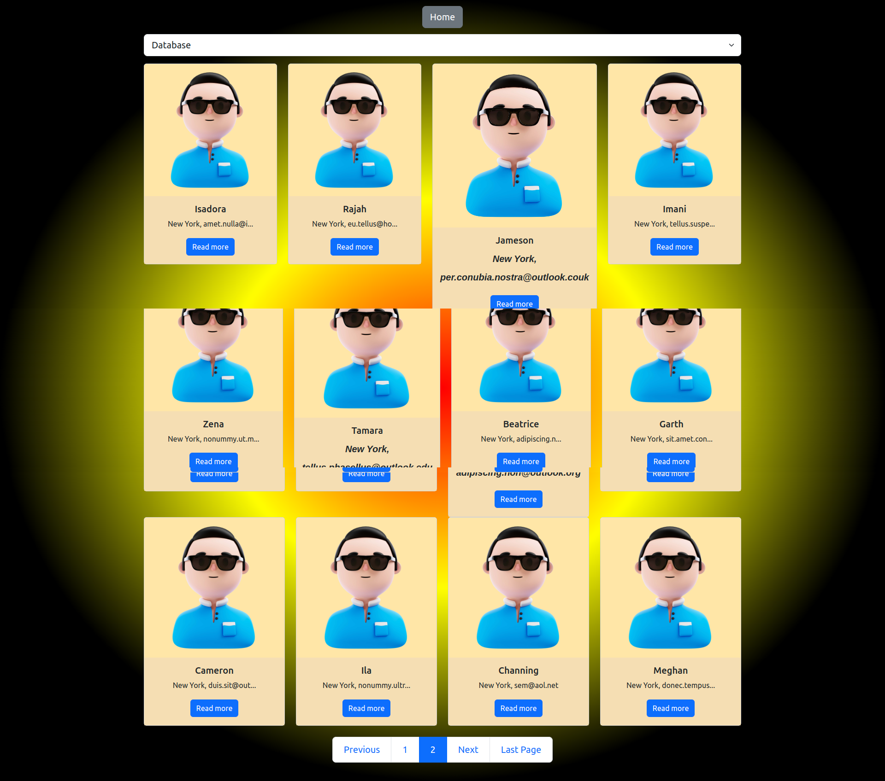
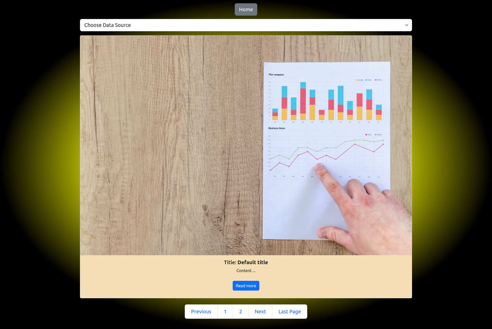

  

<h3 align="center">Data Paginator</h3>

  

    Pagination for incoming data source. Multiple data source integrated : database, free rest api (https://random-data-api.com/) and random generated data. 
     
  

<!-- TABLE OF CONTENTS -->

  
Table of Contents

  <ol>
    <li>
      <a href="#about-the-project">About The Project</a>
      <ul>
        <li><a href="#built-with">Built With</a></li>
      </ul>
    </li>
    <li>
      <a href="#getting-started">Getting Started</a>
      <ul>        
        <li><a href="#installation">Installation</a></li>
      </ul>
    </li>    
    <li><a href="#contact">Contact</a></li>
    <li><a href="#acknowledgments">Acknowledgments</a></li>
  </ol>

<!-- ABOUT THE PROJECT -->
## About The Project

(<a href="#readme-top">back to top</a>)

### Built With

* [![PHP][PHP.net]][PHP-url]
* [![MySQL][MySQL.com]][MySQL-url]
* [![Bootstrap][Bootstrap.com]][Bootstrap-url]
* [![JQuery][JQuery.com]][JQuery-url]

(<a href="#readme-top">back to top</a>)

<!-- GETTING STARTED -->
## Getting Started

The project is using core technologies. No external package manager | composer is being required. Just make sure you got the PHP and MySQL installed on your local machine, and you've got running server instance.

### Prerequisites
 <ul>        
    <li><strong>PHP > 7.2</strong></li>
    <li><strong>MySQL > 8.0</strong></li>
  </ul>

### Installation

1. Clone the repo   
   https://github.com/DoychinBorisov84/paginator.git

(<a href="#readme-top">back to top</a>)

<!-- ACKNOWLEDGMENTS -->
## Acknowledgments
* <strong>Random Data API</strong>: https://random-data-api.com/

(<a href="#readme-top">back to top</a>)

<!-- MARKDOWN LINKS & IMAGES -->
[PHP.net]: https://img.shields.io/badge/php-%23777BB4.svg?style=for-the-badge&logo=php&logoColor=white
[PHP-url]: https://www.php.net/
[MySQL.com]: https://img.shields.io/badge/mysql-%2300f.svg?style=for-the-badge&logo=mysql&logoColor=white
[MySQL-url]: https://www.mysql.com/
[Bootstrap.com]: https://img.shields.io/badge/Bootstrap-563D7C?style=for-the-badge&logo=bootstrap&logoColor=white
[Bootstrap-url]: https://getbootstrap.com
[JQuery.com]: https://img.shields.io/badge/jQuery-0769AD?style=for-the-badge&logo=jquery&logoColor=white
[JQuery-url]: https://jquery.com 

